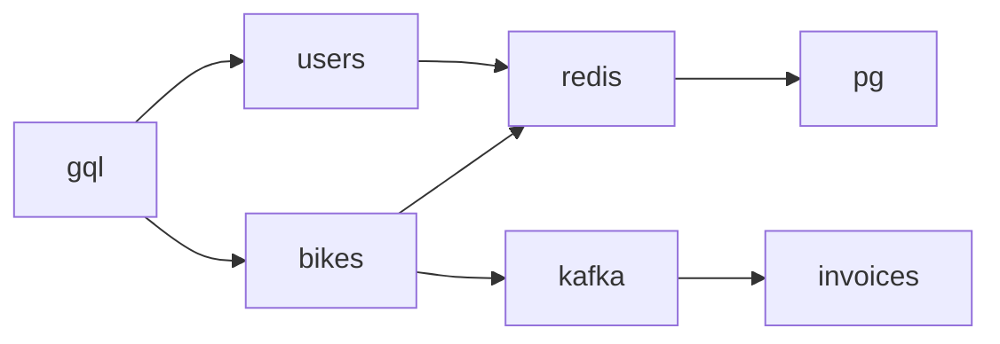

# Telemetry showcase

Simple setup of services:
- gql is GraphQL system gateway
- users is gRPC service handling the user entities
- bikes is gRPC service handling the bike entities
- invoices handles processing and sending invoices

these services are instrumented to create logs, metrics and traces through OTEL.

Project also contains docker compose files to spin up previously mentioned services and also stacks to
analyse and visualise telemetry data.

## Requirements

Collectors:
- [ ] Grafana showcase
- [ ] ELK stack showcase
- [ ] AWS showcase
- [ ] DataDog showcase
- [ ] Maybe more

Metrics:
- [ ] Runtime
- [ ] Host
- [ ] gRPC
- [ ] GraphQL
- [ ] BlackBox exporter (alloy)
- [ ] Redis exporter (alloy)
- [ ] Kafka exporter (alloy)
- [ ] Postgres exporter (alloy)

Tracing:
- [ ] gRPC
- [ ] GraphQL
- [ ] Custom (simple)
- [ ] Redis
- [ ] Gorm
- [ ] Kafka
- [ ] Linked traces
- [ ] Events
- [ ] Error in span

## What to look forward to

- [profiling announcement](https://opentelemetry.io/blog/2024/profiling/)
